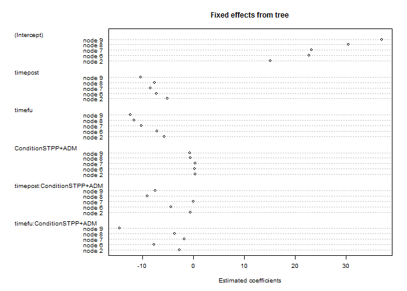
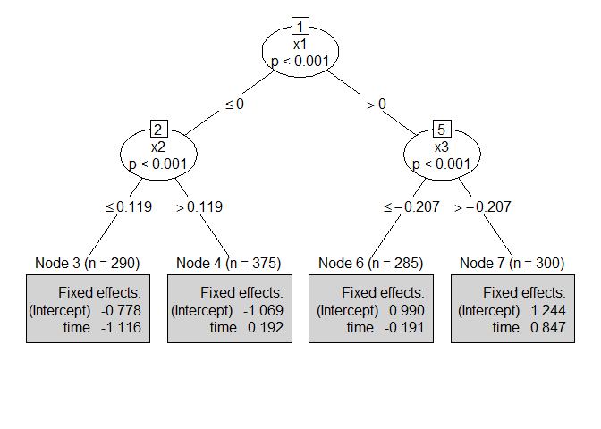
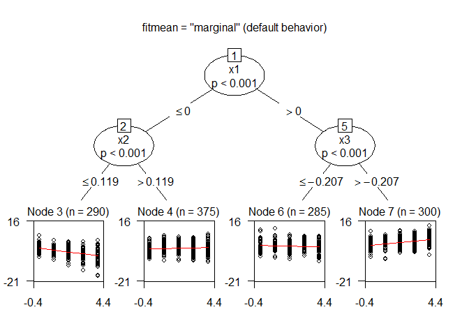

New convergence checks
----------------------

``` r
library("glmertree")
load(file = "ex_data.Rda")
lt_form1 <- HAMD ~ time * Condition | (1|Study/PatientID) | Gender + 
  Age + Zanx + rawHAMDpre
lmt1 <- lmertree(lt_form1, parm = 5:6, verbose = TRUE, data = ex_data)
```

    ## 'log Lik.' -3082.9 (df=9)
    ## 'log Lik.' -2906.231 (df=33)
    ## 'log Lik.' -3082.9 (df=9)
    ## 'log Lik.' -2906.231 (df=33)

After the third iteration, stimation will start to go round in circles, and therefore is stopped after the third iteration. Perhaps we should print a warning, as the estimated coefficients from the `lmtree` and `lmer` will differ (see below).

``` r
lmt2 <- lmertree(lt_form1, parm = 5:6, verbose = TRUE, maxdepth = 3L, 
                 data = ex_data)
```

    ## 'log Lik.' -3082.9 (df=9)
    ## 'log Lik.' -2952.348 (df=21)
    ## 'log Lik.' -2952.348 (df=21)

Here, estimation converged normally.

Effects coding and fixef, coef methods
--------------------------------------

I have undone the earlier changes to the coding `lmer` uses for the fixed effects. The `fixef` and `coef` methods for `(g)lmertree` are a bit tweaky now, but return the `(g)lmer` estimates, in the shape of the `(g)lmtree` `coef` method:

``` r
coef(lmt1)
```

    ##   (Intercept)   timepost     timefu ConditionSTPP+ADM
    ## 2    15.06121  -5.142281  -5.744621         0.3561084
    ## 6    22.67027  -7.289029  -7.150033         0.2733335
    ## 7    23.14383  -8.399012 -10.240685         0.3380078
    ## 8    30.48808  -7.560717 -11.636482        -0.6357101
    ## 9    36.97476 -10.295976 -12.307336        -0.7291667
    ##   timepost:ConditionSTPP+ADM timefu:ConditionSTPP+ADM
    ## 2                -0.59410944                -2.688683
    ## 6                -4.38039379                -7.736910
    ## 7                 0.04145685                -1.793927
    ## 8                -9.07357752                -3.664479
    ## 9                -7.42207738               -14.533598

``` r
coef(lmt1$tree)
```

    ##   (Intercept)   timepost    timefu ConditionSTPP+ADM
    ## 2    19.02247  2.4733812  3.286566        0.09169647
    ## 6    22.69970 -0.3048134  1.271002        1.41698297
    ## 7    23.05642 -1.3040366 -1.515402       -0.57295336
    ## 8    24.52589 -0.7815178 -3.355174        1.00611133
    ## 9    26.91542 -3.1311916 -3.716556        2.91991459
    ##   timepost:ConditionSTPP+ADM timefu:ConditionSTPP+ADM
    ## 2                   1.118088                0.8259278
    ## 6                  -2.039824               -3.6443377
    ## 7                   1.906863                1.8397055
    ## 8                  -6.602613                0.5107370
    ## 9                  -5.117233              -10.1103952

``` r
fixef(lmt1$lmer)
```

    ##                       (Intercept)                            .tree6 
    ##                       15.06121366                        7.60905731 
    ##                            .tree7                            .tree8 
    ##                        8.08261779                       15.42686668 
    ##                            .tree9                   .tree2:timepost 
    ##                       21.91354517                       -5.14228066 
    ##                   .tree6:timepost                   .tree7:timepost 
    ##                       -7.28902941                       -8.39901197 
    ##                   .tree8:timepost                   .tree9:timepost 
    ##                       -7.56071690                      -10.29597613 
    ##                     .tree2:timefu                     .tree6:timefu 
    ##                       -5.74462108                       -7.15003255 
    ##                     .tree7:timefu                     .tree8:timefu 
    ##                      -10.24068520                      -11.63648174 
    ##                     .tree9:timefu          .tree2:ConditionSTPP+ADM 
    ##                      -12.30733630                        0.35610843 
    ##          .tree6:ConditionSTPP+ADM          .tree7:ConditionSTPP+ADM 
    ##                        0.27333347                        0.33800779 
    ##          .tree8:ConditionSTPP+ADM          .tree9:ConditionSTPP+ADM 
    ##                       -0.63571006                       -0.72916667 
    ## .tree2:timepost:ConditionSTPP+ADM .tree6:timepost:ConditionSTPP+ADM 
    ##                       -0.59410944                       -4.38039379 
    ## .tree7:timepost:ConditionSTPP+ADM .tree8:timepost:ConditionSTPP+ADM 
    ##                        0.04145685                       -9.07357752 
    ## .tree9:timepost:ConditionSTPP+ADM   .tree2:timefu:ConditionSTPP+ADM 
    ##                       -7.42207738                       -2.68868349 
    ##   .tree6:timefu:ConditionSTPP+ADM   .tree7:timefu:ConditionSTPP+ADM 
    ##                       -7.73690956                       -1.79392652 
    ##   .tree8:timefu:ConditionSTPP+ADM   .tree9:timefu:ConditionSTPP+ADM 
    ##                       -3.66447934                      -14.53359826

Note that estimation did not converge for the first tree, so the estimates of `lmtree` and `lmer` differ somewhat. If estimation did converge, all estimated parameters are the same, and differ only because of the different effects coding schemes:

``` r
coef(lmt2)
```

    ##   (Intercept)   timepost     timefu ConditionSTPP+ADM
    ## 2    15.53871  -5.090226  -5.700490        0.35909074
    ## 4    24.01177  -8.007926  -9.729916       -0.01721493
    ## 5    34.85573 -10.287905 -12.303572       -0.72916667
    ##   timepost:ConditionSTPP+ADM timefu:ConditionSTPP+ADM
    ## 2                 -0.6432355                -2.722356
    ## 4                 -2.5676225                -3.571130
    ## 5                 -7.4283015               -14.501796

``` r
coef(lmt2$tree)
```

    ##   (Intercept)   timepost     timefu ConditionSTPP+ADM
    ## 2    15.53871  -5.090226  -5.700490        0.35909074
    ## 4    24.01177  -8.007926  -9.729916       -0.01721493
    ## 5    34.85573 -10.287905 -12.303572       -0.72916667
    ##   timepost:ConditionSTPP+ADM timefu:ConditionSTPP+ADM
    ## 2                 -0.6432355                -2.722356
    ## 4                 -2.5676225                -3.571130
    ## 5                 -7.4283015               -14.501796

``` r
fixef(lmt2$lmer)
```

    ##                       (Intercept)                            .tree4 
    ##                       15.53871179                        8.47305867 
    ##                            .tree5                   .tree2:timepost 
    ##                       19.31701772                       -5.09022570 
    ##                   .tree4:timepost                   .tree5:timepost 
    ##                       -8.00792568                      -10.28790499 
    ##                     .tree2:timefu                     .tree4:timefu 
    ##                       -5.70049038                       -9.72991559 
    ##                     .tree5:timefu          .tree2:ConditionSTPP+ADM 
    ##                      -12.30357229                        0.35909074 
    ##          .tree4:ConditionSTPP+ADM          .tree5:ConditionSTPP+ADM 
    ##                       -0.01721493                       -0.72916667 
    ## .tree2:timepost:ConditionSTPP+ADM .tree4:timepost:ConditionSTPP+ADM 
    ##                       -0.64323550                       -2.56762247 
    ## .tree5:timepost:ConditionSTPP+ADM   .tree2:timefu:ConditionSTPP+ADM 
    ##                       -7.42830147                       -2.72235551 
    ##   .tree4:timefu:ConditionSTPP+ADM   .tree5:timefu:ConditionSTPP+ADM 
    ##                       -3.57113015                      -14.50179575

Plotting coefficients without tree
----------------------------------

Current default:

``` r
plot(lmt1, which = "tree", gp = gpar(cex = .5))
```



We could include option `which = "coef"`, in which case coefficients from the tree and random effects would be plotted. For tree coefficients, we can use `dotchart()` from base **`graphics`**, or `dotplot()` from **`lattice`**:

``` r
coefs <- coef(lmt1)
dotchart(coefs, labels = paste("node", rownames(coefs)),
         xlab = "Estimated coefficients",
         main = "Fixef effects from tree", cex= .7)
```


``` r
long_coefs <- data.frame(stack(data.frame(coefs)), 
                         node = rep(paste("node", rownames(coefs)), 
                                    times = ncol(coefs)))
lattice::dotplot(node ~ values | ind, data = long_coefs, as.table=TRUE, 
                 xlab = "Estimated coefficients",
                 main = "Fixed effects from tree")
```


The latter may be preferred, as it provides the same plot style as for the random effects:

``` r
plot(lmt1, which = "ranef")
```

    ## $`PatientID:Study`


    ## 
    ## $Study


Although `dotplot()` introduces a dependency on **`lattice`**, this is already imported by **`lme4`** anyway.

Plotting tree
-------------

``` r
lt.growth <- lmertree(y ~ time | person | x1 + x2 + x3 + x4 + x5, 
                      cluster = person, data = GrowthCurveDemo)
plot.lmertree2(lt.growth, type = "simple")
```



``` r
plot.lmertree2(lt.growth, fitmean = "none", which = "tree")
```



``` r
plot.lmertree2(lt.growth, fitmean = "combined", which = "tree")
```


``` r
plot.lmertree2(lt.growth, fitmean = "marginal", which = "tree")
```


