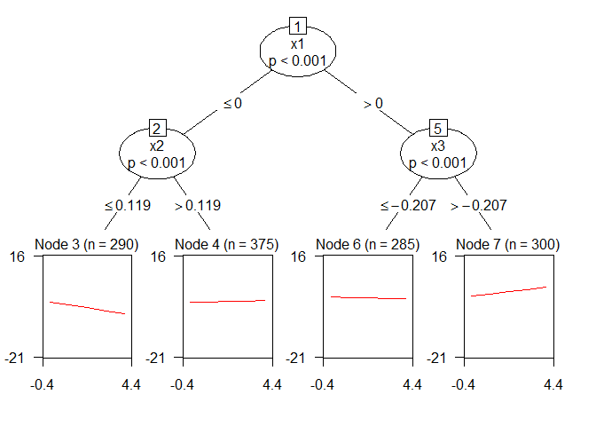
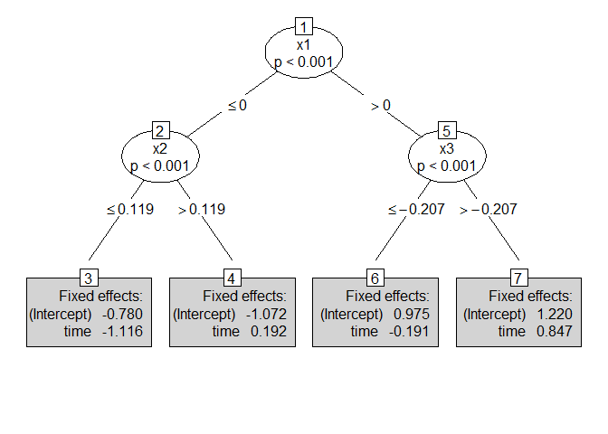

Convergence criterion and contrast coding
=========================================

The convergence check assumed that the log-likelihood value could only increase from one iteration to the next. In the earlier version of **glmertree**, if the log-likelihood decreased (which is quite likely if the tree size decreases from one iteration to the next), estimation converged even though the log-likelihood values are quite different:

``` r
lt <- lmertree(depression ~ treatment | cluster | age + anxiety + duration,
               data = DepressionDemo, verbose = TRUE)
```

    ## 'log Lik.' -302.5352 (df=10)
    ## 'log Lik.' -310.5829 (df=8)

``` r
lt$iterations
```

    ## [1] 2

This yields differences between the estimated coefficients from `lmtree` and `lmer`:

``` r
coef(lt$tree)
```

    ##   (Intercept) treatmentTreatment 2
    ## 3    7.458519             4.183184
    ## 4    8.612009             0.513343
    ## 5   11.098602            -4.584979

``` r
fixef(lt$lmer)
```

    ##                 (Intercept)                      .tree4 
    ##                   7.5001405                   1.0912683 
    ##                      .tree5 .tree3:treatmentTreatment 2 
    ##                   3.5874712                   4.1220824 
    ## .tree4:treatmentTreatment 2 .tree5:treatmentTreatment 2 
    ##                   0.5212592                  -4.5468855

Also, the contrasts used by `lmtree` and `lmer` differ. `lmer` uses treatment coding, where the first level serves as a reference category for the intercepts in the other nodes, whereas `lmtree` estimates a separate intercept for each node.

The convergence and coding issues are corrected in the current development version: For checking convergence, the absolute difference in log-likelihood values from one iteration to the next is checked in `(g)lmertree`:

``` r
lt <- lmertree(depression ~ treatment | cluster | age + anxiety + duration,
               data = DepressionDemo, verbose = TRUE)
```

    ## [1] "iteration "        "1"                 ": "               
    ## [4] "-302.535181660114"
    ## [1] "iteration "       "2"                ": "              
    ## [4] "-310.58293589557"
    ## [1] "iteration "       "3"                ": "              
    ## [4] "-310.58293589557"

``` r
lt$iterations
```

    ## [1] 3

We now have one additional iteration, which yields identical estimates of `lmtree` and `lmer`:

``` r
coef(lt$tree)
```

    ##   (Intercept) treatmentTreatment 2
    ## 3    7.500141            4.1220824
    ## 4    8.591409            0.5212592
    ## 5   11.087612           -4.5468855

``` r
fixef(lt$lmer)
```

    ##                      .tree3                      .tree4 
    ##                   7.5001405                   8.5914088 
    ##                      .tree5 .tree3:treatmentTreatment 2 
    ##                  11.0876118                   4.1220824 
    ## .tree4:treatmentTreatment 2 .tree5:treatmentTreatment 2 
    ##                   0.5212592                  -4.5468855

Also, `lmtree` and `lmer` now use identical coding.

Also, the `coef` and `fixef` methods of `lmertree` now return the `lmer` estimates:

``` r
fixef(lt)
```

    ##   (Intercept) treatmentTreatment 2
    ## 3    7.500141            4.1220824
    ## 4    8.591409            0.5212592
    ## 5   11.087612           -4.5468855

``` r
coef(lt)
```

    ##   (Intercept) treatmentTreatment 2
    ## 3    7.500141            4.1220824
    ## 4    8.591409            0.5212592
    ## 5   11.087612           -4.5468855

These changes have also been implemented for `glmertree`.

Plotting
========

`plot.(g)lmertree` plots the fitted values, which are also based on the (varying) random effects predictions, as well as the effects of additional predictors of the linear model. This yields wiggly lines for continuous predictors, e.g.:

``` r
lt4 <- lmertree(depression ~ treatment + age | cluster | anxiety + duration,
               data = DepressionDemo)
plot(lt4, which = "tree")
```


The wiggly lines may be somewhat counterintuitive, especially when partitioning growth curve models, e.g.:

``` r
form <- formula(paste0("y ~ time | person | ", 
                paste0("x", 1:28, collapse = " + ")))
lt.growth <- lmertree(form, cluster = person, data = GrowthCurveDemo)
plot(lt.growth, which = "tree")
```


I wrote a new plotting function which uses an adjusted version of `node_bivplot` from **partykit**. For plotting the fitted values, it allows for assuming the random effects to be constant (at the population mean of 0) and the fixed effects to be constant (at their sample means), through the following arguments:

-   `fit.ranef`: character; "fixed" (default) or "varying". Only used when `fitmean = TRUE`. If `"constant"`, fitted means will be calculated, with random effects fixed at the population mean of 0. If `"varying"`, fitted means will also be based on the fitted random effects.
-   `fit.fixef`: character, `"constant"` (default) or `"varying"`. Only used when `fitmean = TRUE`. If `"constant"`, fitted means will be calculated, keeping the values of the other predictors in the (G)LM constant at their sample mean or majority value. If `"varying"`, fitted means will also be based on the fitted effects of the remaining predictor variables

``` r
plot.lmertree2(lt.growth, which = "tree")
```


The earlier default behavior (fitted values include variation due to random and fixed effects) can be requested as follows:

``` r
plot.lmertree2(lt.growth, which = "tree", fit.ranef = "varying", fit.fixef = "varying")
```


We can also omit the fitted values:

``` r
plot.lmertree2(lt.growth, which = "tree", fitmean = FALSE)
```


Or omit the observed values:

``` r
plot.lmertree2(lt.growth, which = "tree", observed = FALSE)
```



Or only plot the coefficients:

``` r
plot.lmertree2(lt.growth, which = "tree", type = "simple")
```



By specifying `which = "both"` or `which = "ranef"`, the (co)variances of the random effects would (also) be printed.

Function `plot.glmertree2` provides similar behavior. I have created separate documentation for the new plotting functions:

``` r
?plot.lmertree2
```

Unresolved: Differences between fixef(glmer) and coef(glmtree)
==============================================================

Above, we saw that `fixef(lmer)` and `coef(lmtree)` yield (nearly) identical results in the last iteration of `lmertree`:

``` r
coef(lt) - coef(lt$tree)
```

    ##     (Intercept) treatmentTreatment 2
    ## 3 -6.217249e-15         1.776357e-15
    ## 4  0.000000e+00         1.332268e-15
    ## 5 -5.329071e-15         0.000000e+00

But this is not the case for `glmertree`, `glmtree` and `glmertree`:

``` r
gt <- glmertree(depression_bin ~ treatment | cluster | age + anxiety + duration,
                data = DepressionDemo)
coef(gt) - coef(gt$tree)
```

    ##   (Intercept) treatmentTreatment 2
    ## 3 -0.04423687           0.06661878
    ## 4  0.02120499          -0.01067424
    ## 5  0.03967379          -0.09192917

My current best guess is that Perhaps this is because how we estimate the tree, with the random effects predictions as an offset, is more similar to REML than to ML estimation of a mixed-effects model.

E.g.:

``` r
## Estimate coefficients as lmtree does in lmertree:
lm1 <- lm(depression ~ .tree + .tree:treatment - 1 + offset(.ranef), 
          data = lt$data) 

## Estimate coefficients as lmer does in lmertree:
lmm.REML <- lmer(depression ~ .tree + .tree:treatment - 1 + (1|cluster), 
                 data = lt$data)
lmm.ML <- lmer(depression ~ .tree + .tree:treatment - 1 + (1|cluster), 
               data = lt$data, REML = FALSE)
coef(lm1) - fixef(lmm.REML) ## (nearly) identical 
```

    ##                      .tree3                      .tree4 
    ##                4.440892e-15                1.776357e-15 
    ##                      .tree5 .tree3:treatmentTreatment 2 
    ##                1.421085e-14                8.881784e-16 
    ## .tree4:treatmentTreatment 2 .tree5:treatmentTreatment 2 
    ##               -3.330669e-15                2.664535e-15

``` r
coef(lm1) - fixef(lmm.ML) ## somewhat different 
```

    ##                      .tree3                      .tree4 
    ##                 0.006544763                -0.001094779 
    ##                      .tree5 .tree3:treatmentTreatment 2 
    ##                -0.006019882                -0.008783044 
    ## .tree4:treatmentTreatment 2 .tree5:treatmentTreatment 2 
    ##                -0.001869402                 0.012403206

`glmer` does not support REML, only ML estimation. According to <http://bbolker.github.io/mixedmodels-misc/glmmFAQ.html#reml-for-glmms>, it is unclear how to define the REML criterion in GLMMs. Perhaps because there are different ways to define the residuals with a binary respose.
