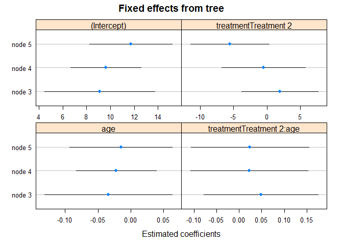
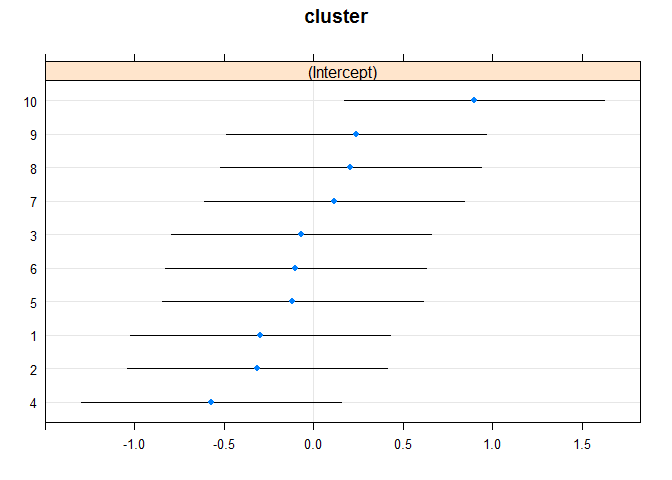
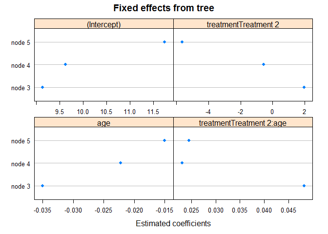

Global and local fixed effects
------------------------------

`coef` and `fixef` methods now have an additional argument: `which`:

``` r
## fit LMM tree including both local and global fixed effect
lt <- lmertree(depression ~ treatment | (age + (1|cluster)) | anxiety + duration,
  data = DepressionDemo)
coef(lt, which = "tree") # default
```

    ##   (Intercept) treatmentTreatment 2
    ## 3    7.818030             4.135299
    ## 5    7.663552             1.515135
    ## 6   10.275181            -0.474434
    ## 7   11.429753            -4.574385

``` r
coef(lt, which = "global")
```

    ##  (Intercept)          age 
    ##  7.818030247 -0.007665174

Also, they have an argument `drop`, which is `FALSE`, by default. It was somewhat easier to always have a matrix of coefficients returned, with a row for every terminal node and a column for every local fixed effect.

Separate documentation for these methods has now been included and can be accessed through any of the following commands:

``` r
?coef.lmertree
?coef.glmertree
?fixef.lmertree
?fixef.glmertree
```

Plotting coefficients without tree structure
--------------------------------------------

### Default settings

``` r
lt <- lmertree(depression ~ treatment*age | cluster | anxiety + duration,
  data = DepressionDemo)
plot.lmertree2(lt, which = "tree.coef")
```



``` r
plot.lmertree2(lt, which = "ranef")
```

    ## $cluster



### No error bars when joint = FALSE

``` r
lt <- lmertree(depression ~ treatment*age | cluster | anxiety + duration,
  data = DepressionDemo, joint = FALSE)
```

    ## boundary (singular) fit: see ?isSingular
    ## boundary (singular) fit: see ?isSingular

``` r
plot.lmertree2(lt, which = "tree.coef")
```



### Warning when global fixef are specified

``` r
lt <- lmertree(depression ~ treatment | (age + (1|cluster)) | anxiety + duration,
  data = DepressionDemo)
plot.lmertree2(lt, which = "tree.coef")
```

    ## Warning in plot.lmertree2(lt, which = "tree.coef"): Global fixed effects
    ## were specified, but will not be plotted.


