Convergence checks
------------------

``` r
library("glmertree")
load(file = "ex_data.Rda")
lt_form1 <- HAMD ~ time * Condition | (1|Study/PatientID) | Gender + 
  Age + Zanx + rawHAMDpre
lmt1 <- lmertree(lt_form1, parm = 5:6, verbose = TRUE, data = ex_data)
```

    ## 'log Lik.' -3082.9 (df=9)
    ## 'log Lik.' -2906.231 (df=33)
    ## 'log Lik.' -3082.9 (df=9)
    ## 'log Lik.' -2906.231 (df=33)

After the third iteration, stimation will start to go round in circles, and therefore is stopped after the third iteration. Perhaps we should print a warning, as the estimated coefficients from the `lmtree` and `lmer` will differ (see below).

``` r
lmt2 <- lmertree(lt_form1, parm = 5:6, verbose = TRUE, maxdepth = 3L, 
                 data = ex_data)
```

    ## 'log Lik.' -3082.9 (df=9)
    ## 'log Lik.' -2952.348 (df=21)
    ## 'log Lik.' -2952.348 (df=21)

Here, estimation converged normally.

Global and local fixed effects
------------------------------

`coef` and `fixef` methods now have an additional argument: `which`:

``` r
## fit LMM tree including both local and global fixed effect
lt <- lmertree(depression ~ treatment | (age + (1|cluster)) | anxiety + duration,
  data = DepressionDemo)
coef(lt, which = "tree") # default
```

    ##   (Intercept) treatmentTreatment 2
    ## 3    7.818030             4.135299
    ## 5    7.663552             1.515135
    ## 6   10.275181            -0.474434
    ## 7   11.429753            -4.574385

``` r
coef(lt, which = "global")
```

    ##  (Intercept)          age 
    ##  7.818030247 -0.007665174

Also, they have an argument `drop`, which is `FALSE`, by default. It was somewhat easier to always have a matrix of coefficients returned, with a row for every terminal node and a column for every local fixed effect.

Separate documentation for these methods has now been included and can be accessed through any of the following commands:

``` r
?coef.lmertree
?coef.glmertree
?fixef.lmertree
?fixef.glmertree
```

Plotting coefficients without tree structure
--------------------------------------------

Issue: The confidence intervals (CIs) are now calculated by taking ±1.96 × *S**E* from the `(g)lmer` estimates. This is not a valid CI, but does give a measure of variability. I have pointed this out in the Details section of the help file, but many users may not read this. Should we point this out out in other ways / places (e.g., print warning when coefficients are plotted)? In addition, using a *z* value of 1.96 may add additional optimism to these CIs. Should use *t* values? Or plot error bars with coefficient estimates ±1 × *S**E* (though this may be confusing, as the error bars of the `ranef` plots (from **`lme4`**) also use ±1.96 × *S**E*)?

Issue: Because of the default treatment contrast coding, the intercepts of all terminal nodes, except the first, are the sum of the overal intercept and the terminal nodes' intercepts.

Issue: If `joint = FALSE`, how should standard errors be computed? Current default is to omit error bars if `joint = FALSE`. Alternatively, we could base them on the standard errors of the node-specific `(g)lm`s (I would expect these to have a downward bias). We could base them on the standard errors of the `(g)lmer`, which are also not really correct. Or we could keep the current default of not plotting them, and perhaps print a warning (if `joint=FALSE` and coefficients are plotted).

``` r
## Default:
lt1 <- lmertree(depression ~ treatment + age | cluster | anxiety + duration,
  data = DepressionDemo)
plot.lmertree2(lt1, which = "tree.coef")
```

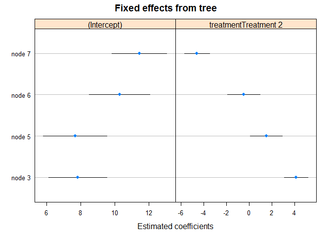

``` r
plot.lmertree2(lt1, which = "ranef")
```

    ## $cluster

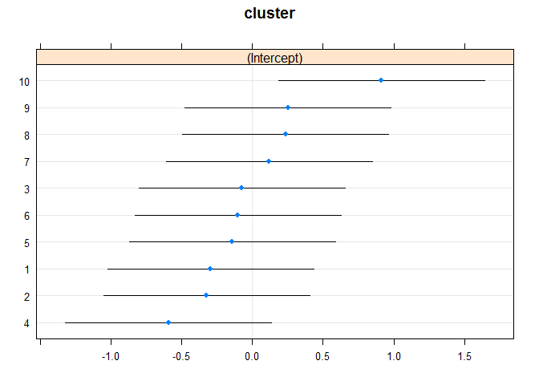

``` r
## No error bars when joint = FALSE:
lt2 <- lmertree(depression ~ treatment + age | cluster | anxiety + duration,
  data = DepressionDemo, joint = FALSE)
```

    ## boundary (singular) fit: see ?isSingular
    ## boundary (singular) fit: see ?isSingular

``` r
plot.lmertree2(lt2, which = "tree.coef")
```

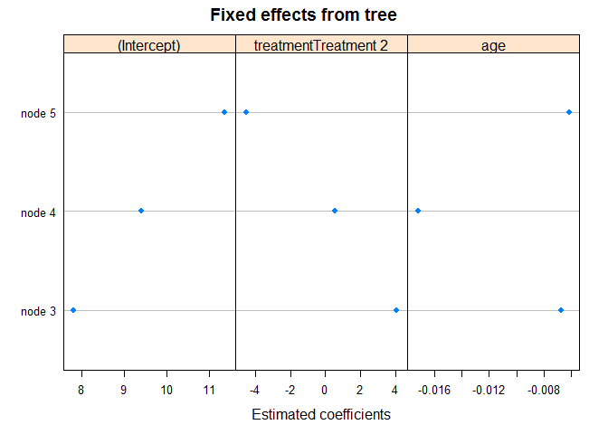

``` r
## When tree depth = 1
lt3 <- lmertree(depression ~ treatment + age | cluster | anxiety + duration,
  data = DepressionDemo, maxdepth = 1L)
plot.lmertree2(lt3, which = "tree.coef")
```

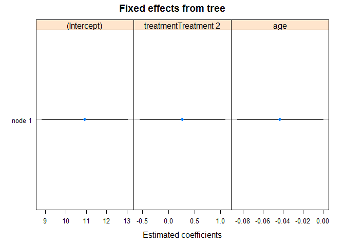

``` r
## When local lm is intercept-only:
lt4 <- lmertree(depression ~ 1 | cluster | anxiety + duration,
  data = DepressionDemo, alpha = .4, maxdepth = 2L)
plot.lmertree2(lt4, which = "tree.coef")
```

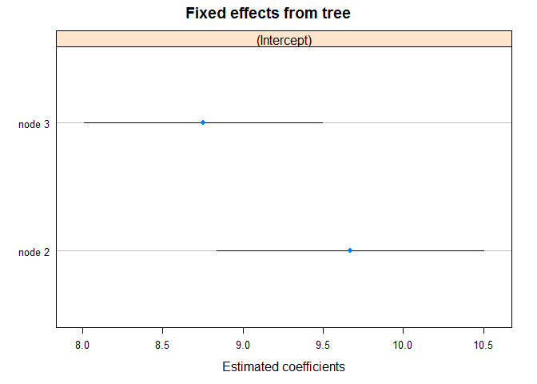

``` r
lt5 <- lmertree(depression ~ 1 | cluster | anxiety + duration,
  data = DepressionDemo, maxdepth = 1L)
plot.lmertree2(lt5, which = "tree.coef")
```

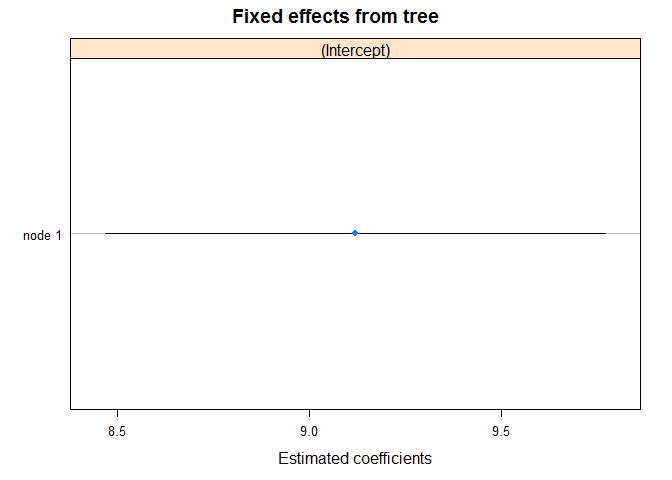

``` r
## When global fixef are specified:
lt6 <- lmertree(depression ~ treatment | (age + (1|cluster)) | anxiety + duration,
  data = DepressionDemo)
plot.lmertree2(lt6, which = "tree.coef")
```

    ## Warning in plot.lmertree2(lt6, which = "tree.coef"): Global fixed effects
    ## were specified, but will not be plotted.


``` r
lt7 <- lmertree(depression ~ treatment | (age + (1|cluster)) | anxiety + duration,
  data = DepressionDemo, maxdepth = 1L)
plot.lmertree2(lt7, which = "tree.coef")
```

    ## Warning in plot.lmertree2(lt7, which = "tree.coef"): Global fixed effects
    ## were specified, but will not be plotted.

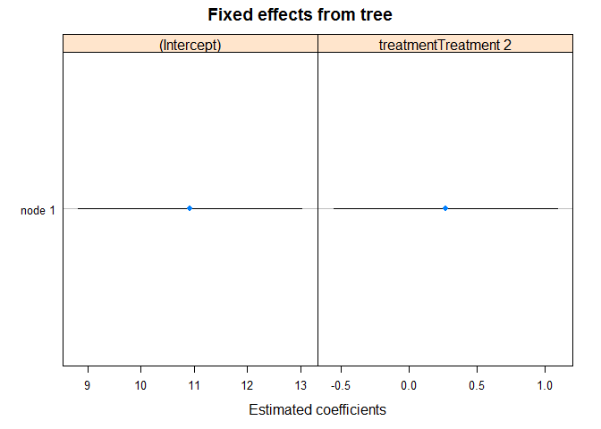

Testing glmertrees:

``` r
## Default:
gt1 <- glmertree(depression_bin ~ treatment + age | cluster | anxiety + duration,
  data = DepressionDemo, family = binomial)
```

    ## Warning in checkConv(attr(opt, "derivs"), opt$par, ctrl =
    ## control$checkConv, : Model failed to converge with max|grad| = 0.0286672
    ## (tol = 0.001, component 1)

    ## Warning in checkConv(attr(opt, "derivs"), opt$par, ctrl =
    ## control$checkConv, : Model failed to converge with max|grad| = 0.0286672
    ## (tol = 0.001, component 1)

``` r
plot.glmertree2(gt1, which = "tree.coef")
```

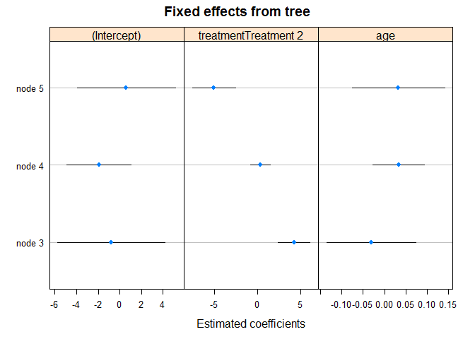

``` r
plot.glmertree2(gt1, which = "ranef")
```

    ## $cluster

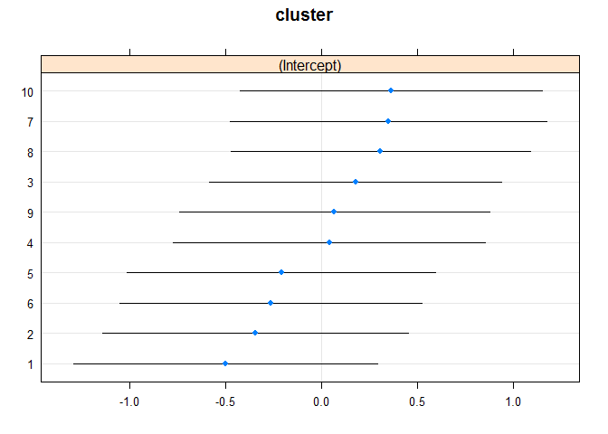

``` r
## No error bars when joint = FALSE:
gt2 <- glmertree(depression_bin ~ treatment + age | cluster | anxiety + duration,
  data = DepressionDemo, joint = FALSE, family = binomial, verbose = TRUE)
```

    ## 'log Lik.' -67.34478 (df=2)

    ## boundary (singular) fit: see ?isSingular

    ## 'log Lik.' -63.94562 (df=2)
    ## 'log Lik.' -67.34478 (df=2)

    ## boundary (singular) fit: see ?isSingular

    ## 'log Lik.' -63.94562 (df=2)

``` r
plot.glmertree2(gt2, which = "tree.coef")
```

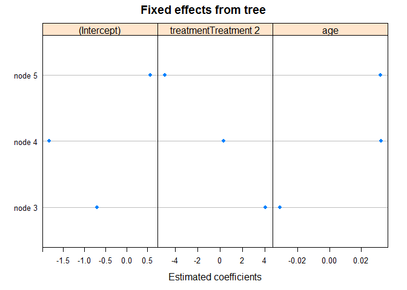

``` r
## CHECK CONVERGENCE!

## When tree depth = 1
gt3 <- glmertree(depression_bin ~ treatment + age | cluster | anxiety + duration,
  data = DepressionDemo, maxdepth = 1L, family = binomial)
plot.glmertree2(gt3, which = "tree.coef")
```


``` r
## When local lm is intercept-only:
gt4 <- glmertree(depression_bin ~ 1 | cluster | anxiety + duration,
  data = DepressionDemo, alpha = .9, maxdepth = 2L, family = binomial)
plot.glmertree2(gt4, which = "tree.coef")
```


``` r
gt5 <- glmertree(depression_bin ~ 1 | cluster | anxiety + duration,
  data = DepressionDemo, maxdepth = 1L, family = binomial)
plot.glmertree2(gt5, which = "tree.coef")
```

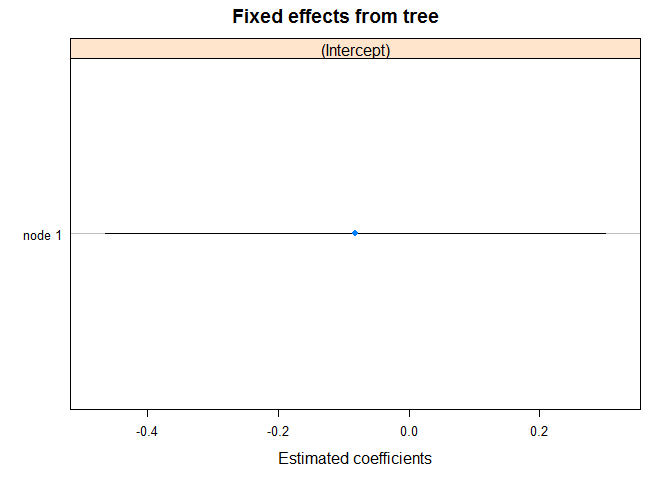

``` r
## With global fixed effects: 
gt6 <- glmertree(depression_bin ~ treatment | (age + (1|cluster)) | anxiety + duration,
  data = DepressionDemo, family = binomial)
plot.glmertree2(gt6, which = "tree.coef")
```

    ## Warning in plot.glmertree2(gt6, which = "tree.coef"): Global fixed effects
    ## were specified, but will not be plotted.

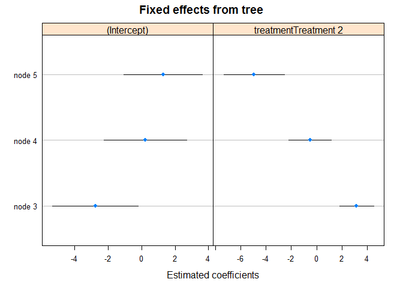

``` r
gt7 <- glmertree(depression_bin ~ treatment | (age + (1|cluster)) | anxiety + duration,
  data = DepressionDemo, maxdepth = 1L, family = binomial)
plot.glmertree2(gt7, which = "tree.coef")
```

    ## Warning in plot.glmertree2(gt7, which = "tree.coef"): Global fixed effects
    ## were specified, but will not be plotted.

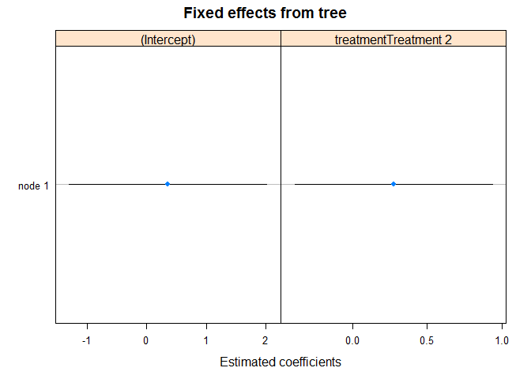
